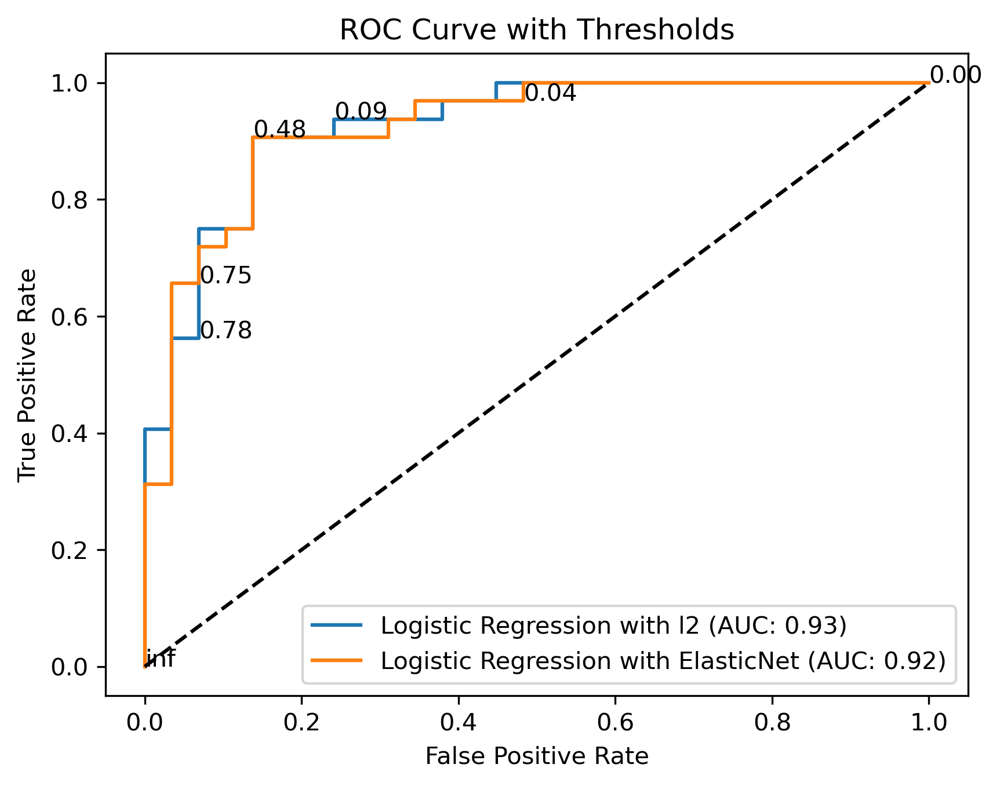

# Heart Disease Prediction

## Overview  
This project aims to develop a Machine Learning model to predict the presence of heart disease in a patient based on various health parameters. The model is trained using classification algorithms and evaluated using metrics like accuracy, precision, recall, and F1-score.

## Dataset  
**Source:** Kaggle  
**Number of Samples:** 303  
**Target Variable:** `target` (1 = Heart disease, 0 = No heart disease)  

## Features:  
| Feature   | Description |
|-----------|------------|
| `age`     | Age of the patient |
| `sex`     | Gender (1 = Male, 0 = Female) |
| `cp`      | Chest pain type (0-3, where 3 is most severe) |
| `trestbps` | Resting blood pressure (in mm Hg) |
| `chol`    | Serum cholesterol (mg/dL) |
| `fbs`     | Fasting blood sugar (1 = > 120 mg/dL, 0 = Normal) |
| `restecg` | Resting electrocardiographic results (0-2) |
| `thalach` | Maximum heart rate achieved |
| `exang`   | Exercise-induced angina (1 = Yes, 0 = No) |
| `oldpeak` | ST depression induced by exercise relative to rest |
| `slope`   | Slope of the peak exercise ST segment (0-2) |
| `ca`      | Number of major vessels (0-3) colored by fluoroscopy |
| `thal`    | Thalassemia (0-3, where 3 is abnormal) |

---

## Project Steps  

1. **Data Preprocessing**  
   - Handling missing values  
   - Encoding categorical variables  
   - Normalizing numerical features  

2. **Exploratory Data Analysis (EDA)**  
   - Visualizing feature distributions  
   - Analyzing relationships between variables  

3. **Model Training**  
   Implementing various classification algorithms:  
   - Logistic Regression  
   - Decision Tree  
   - Random Forest  

4. **Model Evaluation**  
   - Comparing accuracy, precision, recall, AUC, and F1-score  
   - Selecting the best-performing model  

5. **Hyperparameter Tuning**  
   - Optimizing model parameters for better performance  

6. **Final Prediction**  
   - Using the best-performing model to predict heart disease  

---

## 📊 Results  

### ✅ Best Model: **Logistic Regression with Optimal Threshold**  
The evaluation metrics for the best-performing model are as follows:  

- **Precision:** 0.8788  
- **Recall:** 0.9062  
- **F1-Score:** 0.8923  
- **Accuracy:** **(Include your accuracy score here)**  

Additionally, the confusion matrix and ROC curve provide a visual representation of the model's performance.  

### **Confusion Matrix & ROC Curve**  
Below are the performance visualizations:  

- **Confusion Matrix:**  
    

- **ROC Curve:**  
    

---

## 📌 How to Use This Project  

### **1️⃣ Installation & Setup**  
To run this project locally, follow these steps:  

1. Clone this repository:  
   ```bash
   git clone https://github.com/kanna-vamshi-krishna/heart-disease-prediction.git


